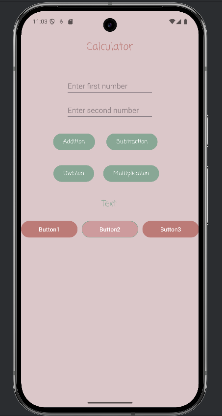
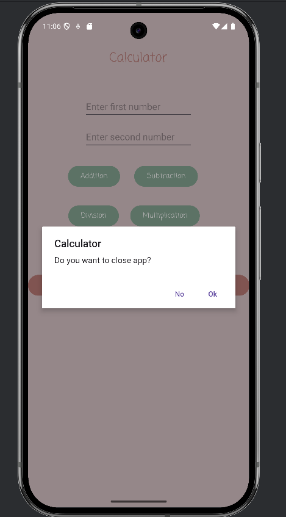

# 📱 Simple Calculator App

A lightweight Android application that performs basic arithmetic operations: addition, subtraction, multiplication, and division.

#### ✨ Features:

* Input two decimal numbers
* Perform `+`, `−`, `×`, and `÷` operations
* Handles empty inputs and division by zero
* Uses Toast and AlertDialog for user feedback and error messages
* Clean and minimal UI for better user experience

#### 🛠 Technologies:

* Java
* Android SDK
* View Binding
* (Optional) Material Components for UI styling

#### 🚀 Getting Started:

1. Clone the repository:

   ```bash
   git clone https://github.com/your-username/simple-calculator-app.git
   ```
2. Open the project in **Android Studio**.
3. Build and run the app on an emulator or physical device.

#### 📸 Preview:





## 💬 About the Update

In the latest update, we’ve added the ability to show user feedback via:

* 🔔 `Toast` notifications (e.g., to show calculation results or minor errors)
* ⚠️ `AlertDialog` pop-ups (e.g., to warn about invalid inputs or division by zero)

These features help make the app more interactive and user-friendly.