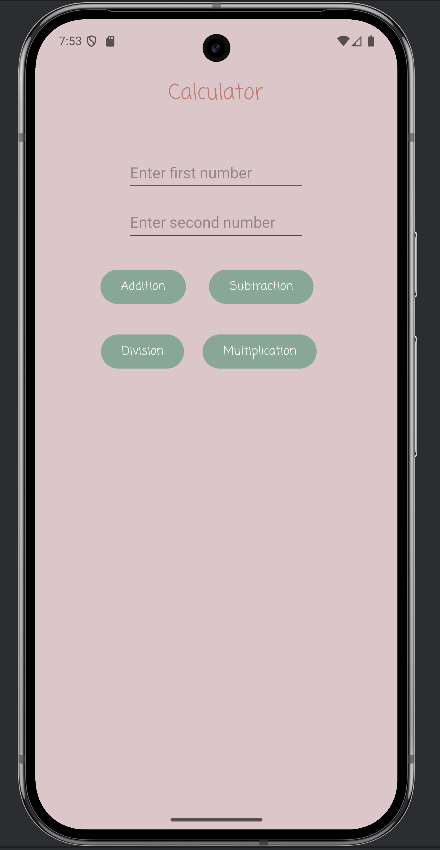

# 📱 Simple Calculator App

A lightweight Android application that performs basic arithmetic operations: addition, subtraction, multiplication, and division.

#### ✨ Features:

* Input two decimal numbers
* Perform `+`, `−`, `×`, and `÷` operations
* Handles empty inputs and division by zero
* Clean and minimal UI

#### 🛠 Technologies:

* Java
* Android SDK
* View Binding
* (Optional) Material Components for UI styling

#### 🚀 Getting Started:

1. Clone the repository:

   ```bash
   git clone https://github.com/your-username/simple-calculator-app.git
   ```
2. Open the project in **Android Studio**.
3. Build and run the app on an emulator or physical device.

#### 📸 Preview:

